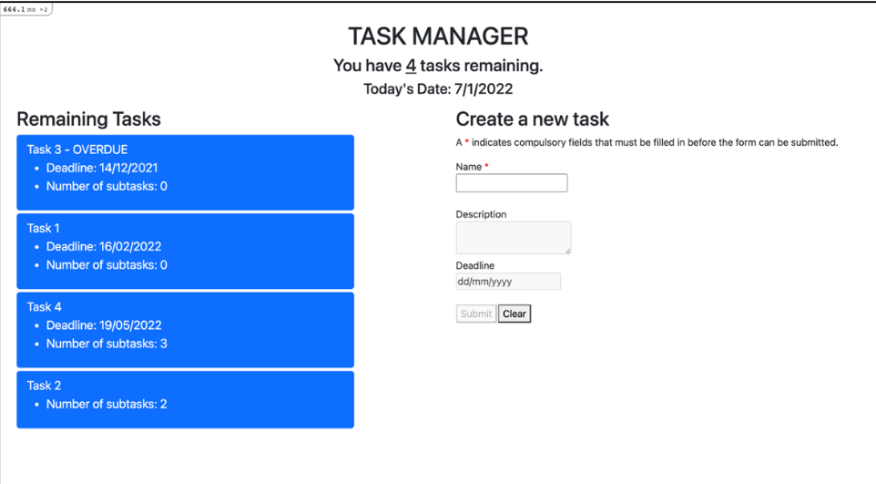
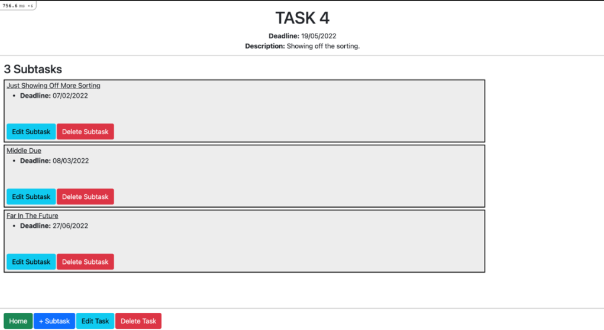

# Task Manager
A simple web app for users to keep track of their tasks, built with Ruby on Rails and React. Done for the winter assignment of Computing for Voluntary Welfare Organisations 2022. 

# How to Run
1. Fork the repo
2. Clone the forked repo into a directory of your choice
3. Open your terminal and navigate into the cloned repo
4. Install yarn if you do not yet have it installed
5. Install dependencies for the project by entering the command `yarn install`
into the terminal
6. Create the database and run migrations by entering the command `rails
db:prepare`
7. Seed the database by entering the command `rails db:seed`, or skip this step
for an empty database
8. Start the server by entering the command `rails s`
9. Open [http://localhost:3000](http://localhost:3000) in a browser of your choice to view the app.
10. You should see a page like the one below, in which case you have successfully
opened

## Home Page
The app opens on the home page, where there is an overview of all tasks in the form of pressable buttons that direct you to the individual task page and a new task form. All tasks are identified by a corresponding slug formed from their name, and the new task form does not allow repeat names.

## Individual Task Page
On an individual task page, you can see the details of the task and all subtasks under it. You can also perform actions such as editing the task, deleting the task, creating new subtasks, and so on.

# Code
The source code is in the folder [**app**](app/). Within **app**, the important folders are [**controllers**](app/controllers), [**javascript**](app/javascript), [**models**](app/models), and [**serializers**](app/serializers). The **controllers**, **models** and **serializers** folder hold the backend Ruby on Rails code to manage the database and send and receive JSON messages upon request. The [**javascript/components**](app/javascript/components) folder holds all the frontend React code that builds the app. The React code is written in JavaScript.

The database, migrations, and seed data are found under the folder [**db**](db/).
